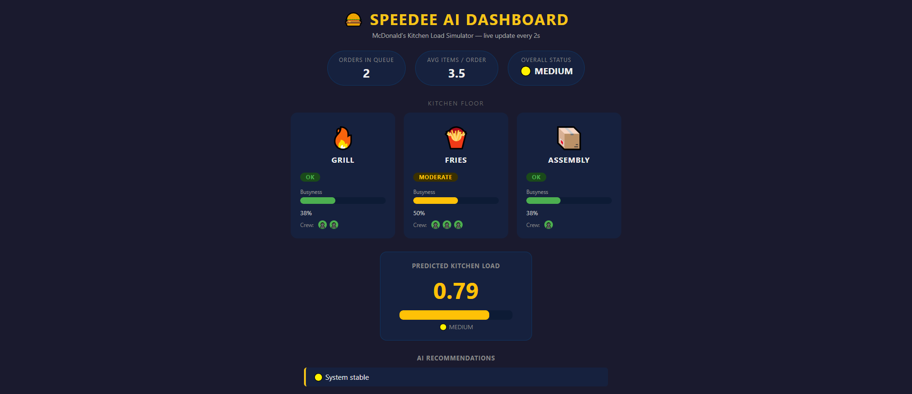

# 🍔 Speedee AI – Kitchen Load Simulator

> A real-time AI-powered dashboard that simulates McDonald's kitchen operations, predicts station load, and recommends crew movements — all visualized as a live kitchen floor.

---

## Dashboard Preview



The dashboard displays three kitchen stations — **Grill**, **Fries**, and **Assembly** — as individual compartments on a live kitchen floor. Each station updates every 2 seconds with busyness levels, crew headcount, and status badges. Stations that need immediate attention pulse with a red alert border.

---

## What It Does

Speedee AI simulates the back-of-house operations of a fast food kitchen. Every 2 seconds it:

1. Generates a snapshot of kitchen state (orders in queue, crew per station, busyness per station)
2. Runs that snapshot through a trained Linear Regression model to predict the overall kitchen load score (0.0 – 1.0)
3. Applies recommendation logic to flag which stations need crew added or shifted
4. Renders everything live in a browser dashboard

---

## Kitchen Stations

| Station | Icon | Role |
|---------|------|------|
| **Grill** | 🔥 | Cooking patties and proteins |
| **Fries** | 🍟 | Managing fryers and sides |
| **Assembly** | 📦 | Building and wrapping orders |

Each station card shows:
- **Status badge** — `OK` (green) / `MODERATE` (yellow) / `CRITICAL` (red)
- **Busyness bar** — color-coded progress bar showing % capacity used
- **Crew dots** — one 👤 icon per crew member currently assigned
- **Attention pulse** — pulsing red border + "NEEDS ATTENTION" tag when busyness ≥ 80%

---

## Overall Load Indicator

Below the station floor is a **Predicted Kitchen Load** panel:

- A large numeric score from `0.00` to `1.00`
- A color-coded bar gauge (green → yellow → red)
- An overall status label: `LOW` / `MEDIUM` / `HIGH`
- A **flashing red alert banner** at the top of the page after 3 consecutive HIGH-load readings

---

## AI Recommendations

The AI recommendation panel suggests real-time crew actions, for example:

- `🔥 Add crew to GRILL` — when grill busyness exceeds 75% during high load
- `📦 Add crew to ASSEMBLY` — when assembly is overloaded
- `🍟 Move crew FROM FRIES` — when fries station is underutilized and load is high
- `🟢 Reduce crew / slow period` — when overall load is low
- `🟡 System stable` — when no action is needed

---

## Project Structure

```
speedee-ai/
├── app.py            # Flask web server + dashboard HTML/CSS/JS
├── model.py          # Dataset generation + Linear Regression model training
├── main.py           # Standalone CLI version of the simulator
├── requirements.txt  # Python dependencies
└── screenshot.png    # Dashboard preview image
```

---

## How to Run

### Step 1 — Install dependencies

```bash
pip install -r requirements.txt
```

This installs Flask, scikit-learn, pandas, and numpy.

### Step 2 — Start the dashboard

```bash
python app.py
```

You will see output like:

```
 * Running on http://127.0.0.1:5000
 * Debug mode: on
```

### Step 3 — Open in your browser

```
http://127.0.0.1:5000/
```

The dashboard will begin live-updating automatically every 2 seconds. No page refresh needed.

---

## How the Model Works

`model.py` generates 300 synthetic kitchen scenarios, each with:

| Feature | Description |
|---|---|
| `orders_in_queue` | Number of pending orders (0–20) |
| `avg_items_per_order` | Average complexity of each order (1–6) |
| `crew_grill` | Number of crew at grill (1–4) |
| `crew_fries` | Number of crew at fries (1–3) |
| `crew_assembly` | Number of crew at assembly (1–4) |
| `grill_busy` | Grill utilization (0.0–1.0) |
| `fries_busy` | Fries utilization (0.0–1.0) |
| `assembly_busy` | Assembly utilization (0.0–1.0) |

A **Linear Regression** model is trained on these features to predict a `load_score`. The trained model is exported and used live in the Flask app to score every new simulated state.

---

## Load Thresholds

| Score | Status | Color | Action |
|-------|--------|-------|--------|
| ≥ 0.80 | HIGH | 🔴 Red | Add crew, move staff |
| 0.40 – 0.79 | MEDIUM | 🟡 Yellow | Monitor stations |
| < 0.40 | LOW | 🟢 Green | Consider reducing crew |

---

## Notes & Next Steps

- All data is currently **simulated**. No real POS or kitchen hardware is connected.
- The natural next step is to plug in a real **POS data feed** (e.g. Oracle MICROS, Square, Toast) to replace the random state generator.
- Additional stations (Drive-Thru, McCafé, Front Counter) could be added as new compartment cards.
- The model could be upgraded from Linear Regression to a time-series model (e.g. LSTM) once real historical data is available.
